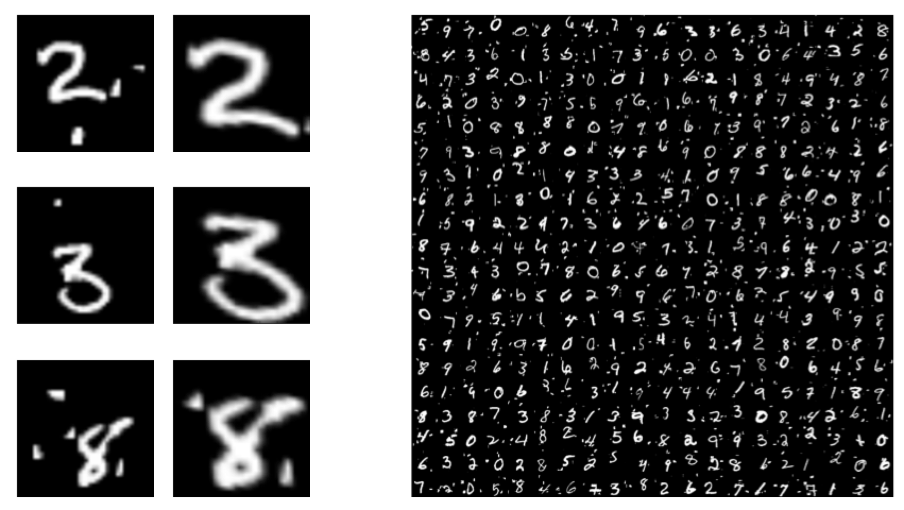

# Spatial Transformer Network

A more recent and maintained version can be found in [Tensorflow/models](https://github.com/tensorflow/models/tree/master/transformer).

Spatial Transformer Networks [1] allow us to attend specific regions of interest of an image while, at the same time, provide invariance to shapes and sizes of the resulting image patches. This can improve the accuracy of the CNN and discover meaningful discriminative regions of an image. 

<div align="center">
  <br><br>
</div>

### API 

A Spatial Transformer Network based on [2] and implemented in Tensorflow.

#### How to use

<div align="center">
  <br><br>
</div>

```python
transformer(U, theta, downsample_factor=1)
```
    
#### Parameters

    U : float 
        The output of a convolutional net should have the
        shape [num_batch, height, width, num_channels]. 
    theta: float   
        The output of the
        localisation network should be [num_batch, 6].
    downsample_factor : float
        A value of 1 will keep the original size of the image
        Values larger than 1 will downsample the image. 
        Values below 1 will upsample the image
        example image: height = 100, width = 200
        downsample_factor = 2
        output image will then be 50, 100
        
    
#### Notes
To initialize the network to the identity transform init ``theta`` to :

```python
identity = np.array([[1., 0., 0.],
                    [0., 1., 0.]]) 
identity = identity.flatten()
theta = tf.Variable(initial_value=identity)
```        

#### Experiments

<div align="center">
  <br><br>
</div>

We used cluttered MNIST. Left columns are the input images, right columns are the attended parts of the image by an STN.

### References

[1] Jaderberg, Max, et al. "Spatial Transformer Networks." arXiv preprint arXiv:1506.02025 (2015)

[2] https://github.com/skaae/transformer_network/blob/master/transformerlayer.py
